cd# Progress log of the hackathon:

```
20th sep;
```
- Aditi
     >"Final all the web pages."
     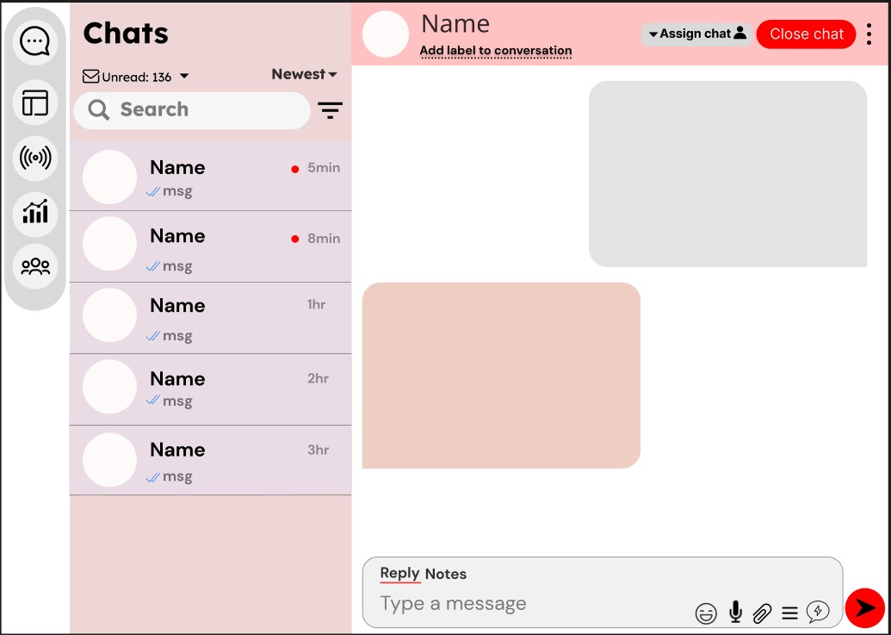
     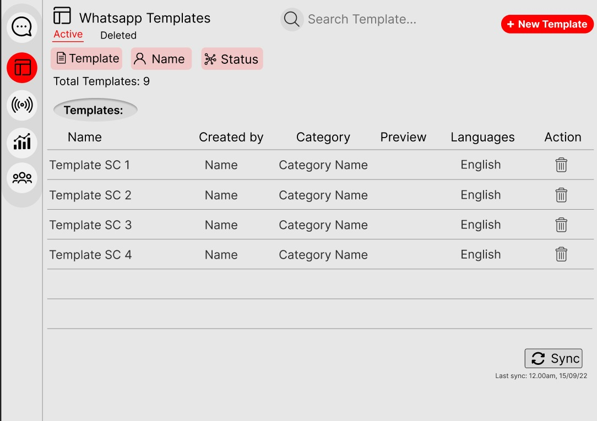
     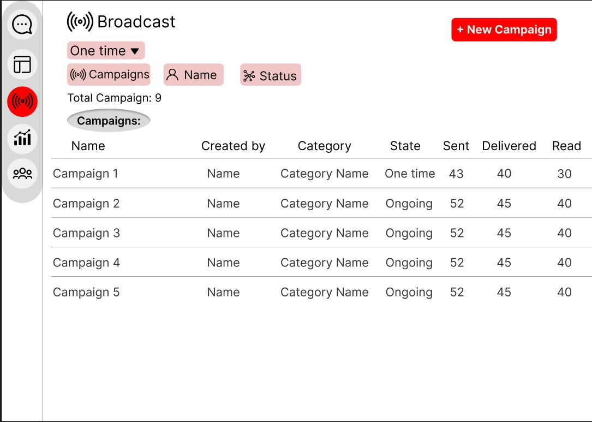
     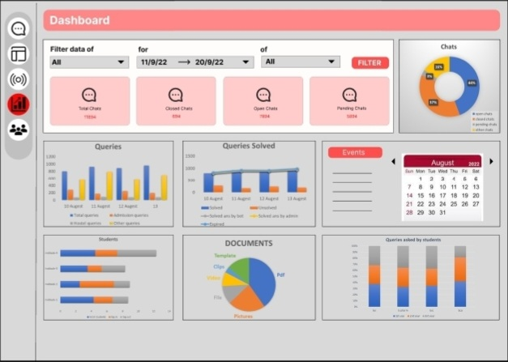
     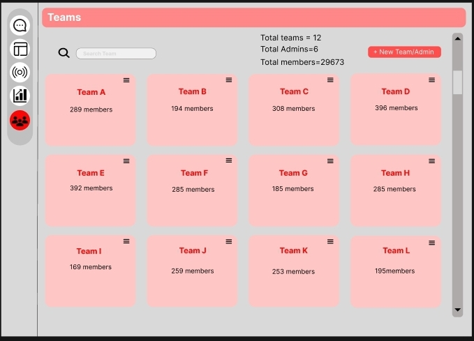
- Mohit
 >worked on synopsis and pdf, almost done
```
19th sep;
```
- Aditi
     >"Today i made colour palette."
     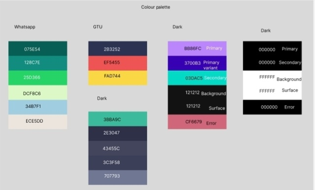
```
18th sep;
```
- Aditi
     >"Today i edited the Dashboard of chatbot using figma and ppt."
     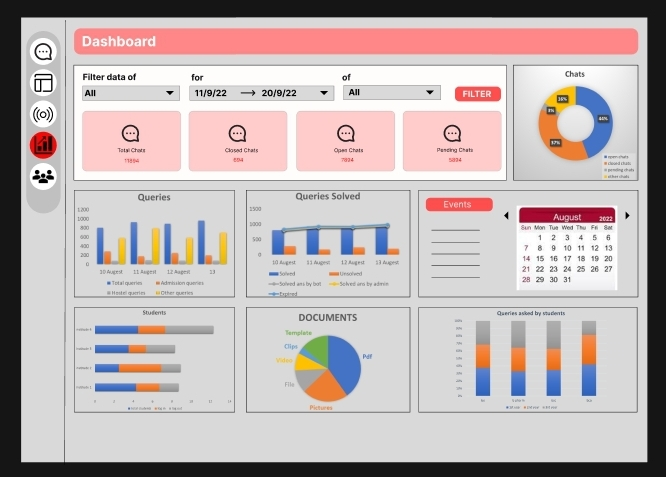
```
17th sep;
```
-Maulik
   >"start a work on create frontend by useing the chatengine and given ui."
   
- Aditi
     >"Today i designed Dashboard of chatbot using figma and ppt."
     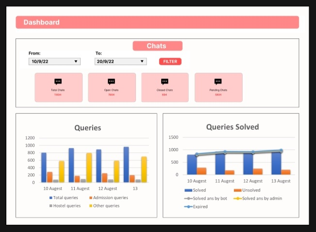
```
15th sep;
```
- Maulik
     >"today i created the sample chatbot in react and learn about the chatengine for create chatbox."
- Aditi
     >"Today i designed the main website panel using figma."
     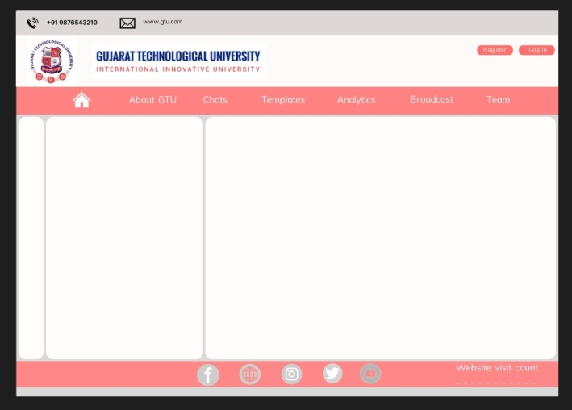
- Tirth
     >"Updated UI of chat panel"
     
```
14th sep;
```
- Maulik
    >"Learn about the react-chat bot and diffrent components."
- Aditi
     >"Today i edited the admin panel using figma."
     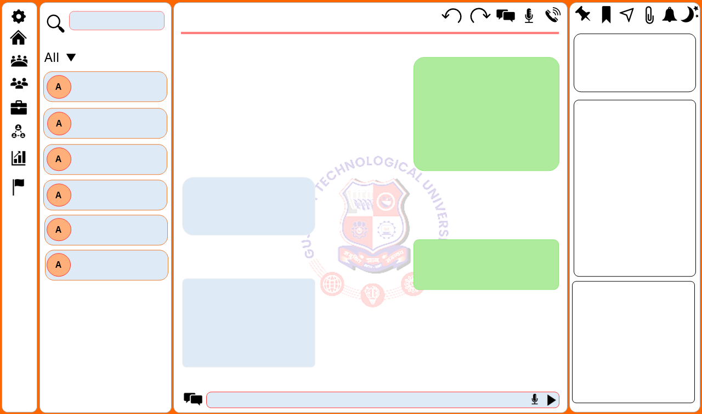
     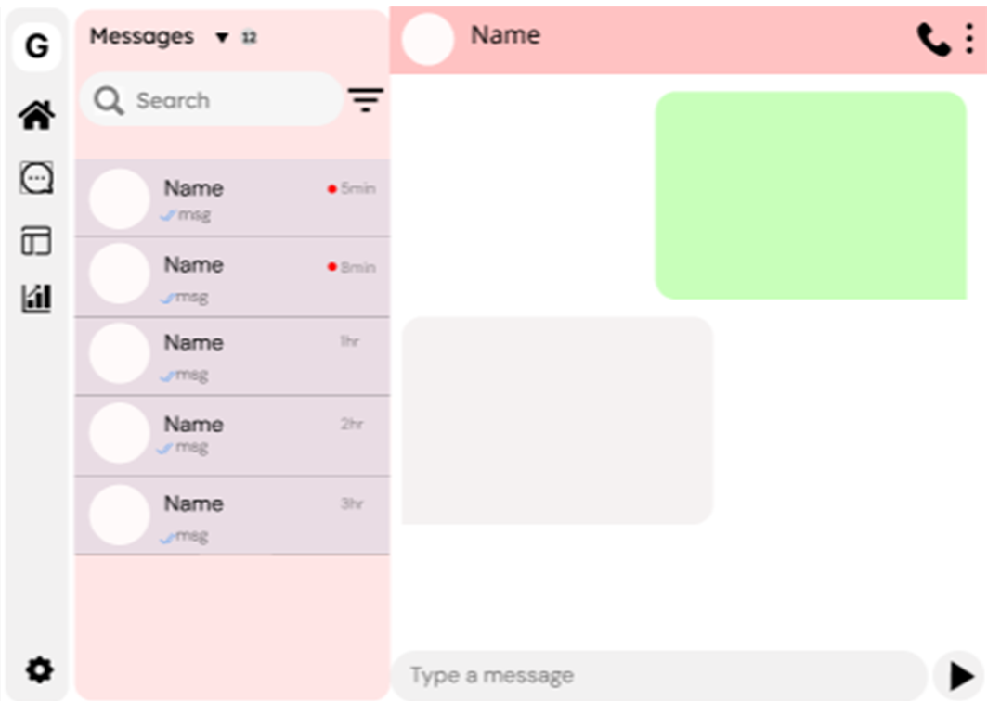
- Dhyaensh
     >    "Today I created server using express and learnt some concepts and functions of express library,
          >1. leart about middlewarefunctions
          >2. learnt how to render HTML with Static folders to include CSS and all other types of static files using middlewarefunctions";
```
13th sep;
```

- Maulik
     >"Today i recall some concepts of JS and some basics of react js."
- Mohit:
     >"I practiced some DSA, Learned some more JavaScript , and watched a [Podcast](https://www.youtube.com/watch?v=Ol_n4paZ0Ug&t=9s) on UI/UX development"
- Tirth:
     >"Learned how figma works and created chat panel in it."
     
- Karan:
     >"Created architecture of whole project and discussed it with dhyanesh:
     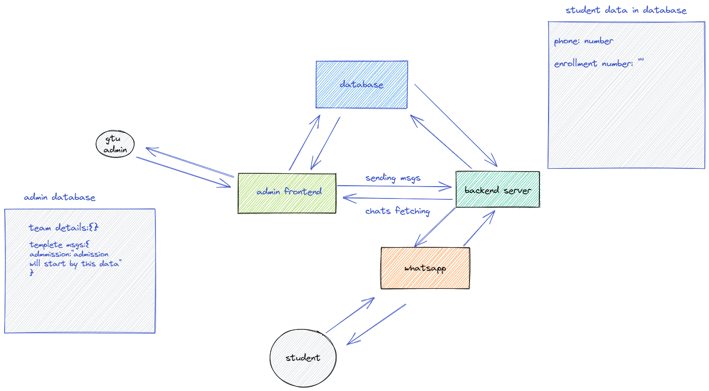
```
12th sep;
```
- Dhyanesh:
     >"today i lerned how to host a local server using basic HTTP module,and launched my server for veryfirst time"


- Tanishqua:
     >"Learnt about UX Design and my role towards designing a more user-friendly interface!"

<<<<<<< HEAD
- Maulik
     >"Today i recall some concepts of JS and some basics of react js."
=======
>>>>>>> ae0940ce7f578c23806cd571c29f85c8df7e841d

